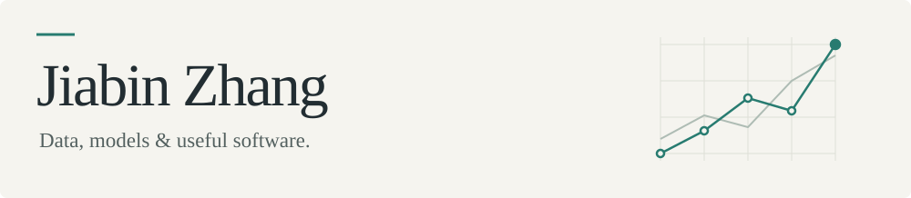

<picture>
  <source media="(max-width: 600px) and (prefers-color-scheme: dark)" srcset="assets/header-dark-mobile.svg">
  <source media="(max-width: 600px)" srcset="assets/header-light-mobile.svg">
  <source media="(prefers-color-scheme: dark)" srcset="assets/header-dark.svg">
  <source media="(prefers-color-scheme: light)" srcset="assets/header-light.svg">
  
</picture>

### Selected Projects

[**Portfolio Risk Analytics Engine**](https://github.com/jiabin2001/portfolio-risk-analytics)\
Market-risk modelling with ARMA–GARCH marginals, copula dependence, Monte Carlo VaR/Expected Shortfall, and rolling out-of-sample backtesting.

[**England Fire-Spread Machine Learning**](https://github.com/jiabin2001/england-non-domestic-fire-ml)\
Temporal validation of Logistic Regression, Random Forest and XGBoost on more than 200,000 non-domestic building-fire incidents in England.

[**London Resilience Demo**](https://github.com/jiabin2001/london-resilience-demo)\
Interactive TypeScript/React prototype for community capability, venue-status verification, support coordination and resilience learning workflows.

[**RWA Portfolio Manager**](https://github.com/jiabin2001/rwa-portfolio-manager)\
Hackathon prototype for risk management of tokenised real-world assets using agent-based signals, portfolio constraints and auditable execution.

### Tools

Python · R · SQL · TypeScript · Git · GIS

---
